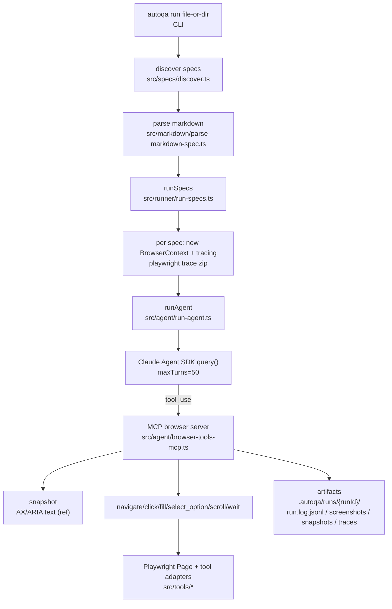

# AutoQA-Agent

基于 Claude Agent SDK + Playwright 的“文档即测试”（Docs-as-Tests）自动化验收 CLI。

当前进展：**Epic 1/2 的执行闭环已完成**，示例用例可以较稳定跑通；断言/自愈护栏与“导出 Playwright Test”能力在 Roadmap 中推进。

## 1. 目标与原理

### 目标

- **消灭脚本脆弱性**：尽量减少 UI 微小变动导致的测试维护成本。
- **文档即测试**：让 QA/产品用 Markdown 编写步骤与预期结果，直接作为可执行验收。
- **更轻的 Agent 代码**：把“推理/循环/会话”交给 Anthropic 官方的 Claude Agent SDK，我们重点投入在浏览器工具质量与运行产物。

### 原理（How it works）

- **Markdown → 结构化上下文**：`autoqa run` 读取 Markdown spec，提取 `## Preconditions` 与有序列表步骤，拼装为 Agent 的任务提示词。
- **Claude Agent SDK 托管 ReAct 循环**：由 SDK 负责“观察-思考-行动”的多轮对话与工具调度。
- **MCP 浏览器工具面**：通过 MCP server 向 Agent 暴露浏览器工具（`snapshot/navigate/click/fill/select_option/scroll/wait`）。
- **Ref-first 执行策略**：Agent 先调用 `snapshot` 获取可访问性快照（包含稳定 `ref`），然后优先用 `ref` 执行 `click/fill/select_option`，失败再回退到语义描述（`targetDescription`）。
- **截图/快照采集**：工具调用会按 `AUTOQA_TOOL_CONTEXT` 采集 screenshot/snapshot（可选），并在 ToolResult/日志中附带元信息；是否写盘由 `AUTOQA_ARTIFACTS` 控制。
- **错误回流触发下一轮推理**：当工具失败时会以 `isError: true` 返回 tool_result，SDK 会进入下一轮推理尝试修复（护栏/重试上限见 Roadmap）。

### 架构/执行流程图（Mermaid）

## 2. 已实现功能

### CLI 工作流

- **`autoqa init`**
  - 生成 `autoqa.config.json`（当前仅包含 `schemaVersion`）。
  - 生成示例 spec：`specs/login-example.md`（若已存在则跳过）。
  - 探测鉴权：优先使用 Claude Code 已授权能力；否则提示/使用 `ANTHROPIC_API_KEY`。

- **`autoqa run <file-or-dir>`**
  - 发现并按确定性顺序收集 Markdown specs（单文件或目录）。
  - 解析 Markdown 结构（Preconditions + Steps）。
  - **每个 spec 创建新的 Browser Context**（隔离 cookie/session），同一次 run 复用同一个 Browser（降低启动开销）。
  - **录制 Playwright trace**（每个 spec 一份 zip）。
  - 输出运行关键信息：`runId/baseUrl/headless/debug/artifactRoot`。
  - 退出码约定：`0=全部通过`、`1=用例执行失败`、`2=用户输入/配置错误`。

### Markdown Spec 最小规范

- 必须包含：
  - `## Preconditions`（且至少 1 个列表项）
  - 有序列表步骤（例如 `1. ...` / `2. ...`），可放在 `## Steps` 下
- Step 识别：以 `Verify/Assert` 或 `验证/断言` 开头的步骤会被标记为“断言类步骤”（断言工具见 Roadmap）。

### 浏览器工具（MCP）

- **`snapshot`**：采集可访问性快照（AX/ARIA），用于生成稳定 `ref`，并可按需落盘。
- **`navigate(url)`**：支持绝对 URL 或相对路径（`/path`，相对 `--url` 传入的 baseUrl）。
- **`click({ ref?, targetDescription? })`**：优先 `ref`，否则用语义描述做启发式定位（role/text/属性选择器等）。
- **`fill({ ref?, targetDescription?, text })`**：优先 `ref`，否则启发式定位输入框并填充。
- **`select_option({ ref, label })`**：基于 `ref` 对下拉框选择指定 label。
- **`scroll({ direction, amount })`**：按方向与像素量滚动。
- **`wait({ seconds })`**：显式等待。

### 运行产物与可观测性

默认产物目录：`.autoqa/runs/<runId>/`

- **结构化日志**：`.autoqa/runs/<runId>/run.log.jsonl`
- **截图**：`.autoqa/runs/<runId>/screenshots/*.jpg`（默认仅失败/按配置写入）
- **快照**：`.autoqa/runs/<runId>/snapshots/*.aria.yaml` / `*.ax.json`
- **Trace**：`.autoqa/runs/<runId>/traces/*.zip`

## 3. ROADMAP

### Epic 3：验收判定与自愈闭环（断言 + 失败重试 + 护栏）

- **断言工具**：实现 `assertTextPresent` / `assertElementVisible`，断言失败映射为 `isError: true` 触发 SDK 下一轮推理。
- **统一自愈护栏**：加入 `maxToolCallsPerSpec / maxConsecutiveErrors / maxRetriesPerStep` 等硬上限，避免无限循环与成本失控。
- **更 CI 友好的失败产物与汇总**：失败时最小可复现信息、路径输出更完善。

### Epic 4：沉淀与导出（从自然语言执行到 Playwright Test）

- **动作 IR 记录**：成功动作写入结构化 IR。
- **稳定 locator 候选生成与验证**：运行时生成多种候选并做无副作用校验，仅保留可用候选。
- **自动导出 `@playwright/test`**：把跑通的 spec 导出为可在 CI 执行的 `.spec.ts`（不依赖 Agent、避免会话内 `ref`）。
