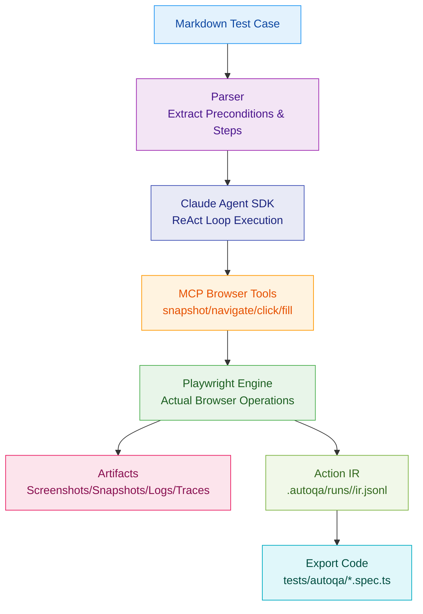

# AutoQA-Agent

[](https://github.com/terryso/AutoQA-Agent/stargazers)
[](https://github.com/terryso/AutoQA-Agent/issues)
[](https://github.com/terryso/AutoQA-Agent/pulls)
[](https://github.com/terryso/AutoQA-Agent/pulls)
[](https://github.com/terryso/AutoQA-Agent/commits)
[](https://github.com/terryso/AutoQA-Agent)
[](https://nodejs.org/)

**[English](README.md) | [中文](README.zh.md)**

A "Docs-as-Tests" automated acceptance testing CLI tool based on Claude Agent SDK + Playwright.

> **Current Status**: Core capabilities of Epic 1-4 have been implemented: `autoqa init` initialization, `autoqa run` execution loop, assertions + self-healing guardrails, and action IR recording with automatic export to `@playwright/test` cases.

## 📖 Table of Contents

- [Overview](#overview)
- [Quick Start](#quick-start)
- [How It Works](#how-it-works)
- [Implemented Features](#implemented-features)
- [Usage Guide](#usage-guide)
- [Configuration](#configuration)
- [Artifacts](#artifacts)
- [Development Guide](#development-guide)
- [Roadmap](#roadmap)
- [Contributing](#contributing)
- [License](#license)

## Overview

> **Built with BMAD-METHOD**: This project is developed using the [Breakthrough Method for Agile AI-Driven Development](https://github.com/bmad-code-org/BMAD-METHOD), featuring 21 specialized AI agents and structured workflows that scale from bug fixes to enterprise platforms.

AutoQA-Agent is an innovative automated testing tool that enables QA and product managers to write acceptance tests in natural language Markdown, which are directly converted into executable test flows.


For more detailed architecture boundaries and constraints, please refer to [`docs/architecture.md`](docs/architecture.md).

### Core Objectives

- **Eliminate Script Fragility**: Reduce test maintenance costs caused by minor UI changes through intelligent locator strategies
- **Docs as Tests**: Write test cases in Markdown, allowing non-technical personnel to participate in test writing
- **Lightweight Agent Architecture**: Rely on Claude Agent SDK to manage reasoning loops, focusing on optimizing browser tool quality

## Quick Start

### Prerequisites

- Node.js >= 20
- npm or yarn
- Claude Code authorized (recommended) or set `ANTHROPIC_API_KEY`

### Installation

```bash
# Clone repository
git clone https://github.com/terryso/AutoQA-Agent.git
cd AutoQA-Agent

# Install dependencies
npm install

# Build project
npm run build

# Global installation (optional)
npm link
```

### Initialize Project

```bash
# Initialize configuration
autoqa init

# This will create:
# - autoqa.config.json - Configuration file
# - specs/ - Test case directory
# - specs/login-example.md - Example Markdown case (created if not exists)
```

### Run Your First Test

```bash
# Run a single test (built-in example)
autoqa run specs/saucedemo-01-login.md --url https://www.saucedemo.com/

# Run all tests in directory
autoqa run specs/ --url https://www.saucedemo.com/

# Debug mode (show browser interface)
autoqa run specs/saucedemo-01-login.md --url https://www.saucedemo.com/ --debug
```

## How It Works



### Execution Flow

1. **Markdown Parsing**: Extract preconditions and test steps
2. **Agent Execution**: Claude Agent SDK manages "observe-think-act" loop
3. **Intelligent Locating**: Prioritize stable ref references, fallback to semantic descriptions on failure
4. **Assertions & Self-Healing**: Execute assertion tools for Verify/Assert steps; flow back error context for retry on failure, limited by guardrails
5. **Result Collection**: Automatically record screenshots, snapshots, traces, and structured logs
6. **沉淀与导出**: Record action IR, and automatically export `@playwright/test` cases to `tests/autoqa/` after spec success

## Implemented Features

### CLI Commands

- **`autoqa init`** - Initialize project configuration
- **`autoqa run <path> --url <baseUrl>`** - Execute test cases (`--url` is required)
- **`autoqa run --debug`** - Run in debug mode
- **`autoqa run --headless`** - Run in headless mode (default)

### Browser Tools

| Tool | Description | Parameters |
|------|-------------|------------|
| `snapshot` | Capture accessibility snapshot | - |
| `navigate` | Navigate to specified page | url |
| `click` | Click element | ref, targetDescription |
| `fill` | Fill input field | ref, targetDescription, text |
| `select_option` | Select dropdown option | ref, label |
| `scroll` | Scroll page | direction, amount |
| `wait` | Explicit wait | seconds |
| `assertTextPresent` | Assert page contains specified text with at least one visible match | text |
| `assertElementVisible` | Assert target element is visible (supports semantic description parsing) | targetDescription |

## Usage Guide

### Writing Test Cases

Test cases use Markdown format and need to include the following structure:

```markdown
# Test Case Title

## Preconditions

- Base URL: https://example.com
- Test account created
- Browser supports JavaScript

## Steps

1. Navigate to /login
2. Verify the login form is visible
3. Fill the username field with testuser
4. Fill the password field with password123
5. Click the "Login" button
6. Verify the user is redirected to dashboard
```

Note: In the current version, Base URL is provided by `autoqa run --url <baseUrl>`; the Base URL in `## Preconditions` is for readability only and does not participate in parsing.

### Assertion Statements

Steps starting with the following will be recognized as assertions:

- `Verify` / `Assert`
- `验证` / `断言`

### Best Practices

1. **Keep Steps Independent**: Each step should be an independent operation
2. **Use Clear Descriptions**: Avoid vague operation descriptions
3. **Use Assertions Reasonably**: Add assertions at key verification points
4. **Manage Test Data**: Use Preconditions to declare required test data

## Configuration

`autoqa.config.json` configuration file:

```json
{
  "schemaVersion": 1,
  "guardrails": {
    "maxToolCallsPerSpec": 200,
    "maxConsecutiveErrors": 8,
    "maxRetriesPerStep": 5
  }
}
```

Note:

- `autoqa init` will generate this file in the current directory.
- `autoqa run` also supports running without a generated configuration file (will use built-in defaults), but still requires Base URL to be provided via `--url`.

### Environment Variables

| Variable | Description | Default |
|----------|-------------|---------|
| `ANTHROPIC_API_KEY` | Claude API key | - |
| `AUTOQA_ARTIFACTS` | Artifact retention strategy: `all` / `fail` / `none` | `fail` |
| `AUTOQA_TOOL_CONTEXT` | Context injected to Agent during tool calls: `screenshot` / `snapshot` / `none` | `screenshot` |
| `AUTOQA_PREFLIGHT_NAVIGATE` | Whether to pre-warm with `page.goto(baseUrl)` before run: `1` to enable | - |

## Artifacts

After execution completes, test artifacts and export results mainly include:

```
.autoqa/runs/2024-01-01T12-00-00/
├── run.log.jsonl    # Structured execution log
├── ir.jsonl         # Action IR (for exporting Playwright Test)
├── screenshots/     # Page screenshots (depends on AUTOQA_ARTIFACTS)
├── snapshots/       # Accessibility snapshots (depends on AUTOQA_ARTIFACTS)
└── traces/          # Playwright Traces (depends on AUTOQA_ARTIFACTS)
```

Additionally, successfully run specs will automatically export `@playwright/test` cases to:

```
tests/autoqa/*.spec.ts
```

## Development Guide

### Project Structure

```
src/
├── agent/           # Claude Agent SDK integration, guardrails
├── auth/            # Auth detection
├── browser/         # screenshot/snapshot
├── cli/             # CLI argument parsing and command routing
├── config/          # autoqa.config.json reading and validation
├── ir/              # Action IR, locator candidates and data structures for export dependencies
├── markdown/        # Markdown spec parsing
├── runner/          # spec lifecycle, trace/export orchestration
├── specs/           # spec discovery
└── tools/           # Playwright adapters + assertions
```

### Build and Test

```bash
# Development mode
npm run dev

# Run tests
npm test

# Build production version
npm run build
```

## Roadmap

### Completed (Epic)

- [x] Epic 1: Zero-config onboarding (project initialization)
- [x] Epic 2: Execution loop (from Markdown driving browser to complete flow)
- [x] Epic 3: Acceptance judgment and self-healing loop (assertions + failure retry + guardrails)
- [x] Epic 4: Sedimentation and export (action IR + automatic export Playwright Test)

### Backlog (Optional Directions)

- [ ] Enrich export capabilities (more semantic step parsing and more complete assertion mapping)
- [ ] Add more example specs and end-to-end demo projects
- [ ] Continuous improvement of documentation and architecture diagrams

## Star History

[](https://www.star-history.com/#terryso/AutoQA-Agent&type=date&legend=top-left)

## Contributing

We welcome all forms of contributions!

### Submitting Issues

- Use Issue templates to report bugs or suggest features
- Provide detailed reproduction steps and environment information

### Submitting Pull Requests

1. Fork the project
2. Create feature branch: `git checkout -b feature/amazing-feature`
3. Commit changes: `git commit -m 'Add amazing feature'`
4. Push branch: `git push origin feature/amazing-feature`
5. Create Pull Request

### Development Guidelines

- Follow existing code style
- Add appropriate tests
- Update relevant documentation

## License

This project is licensed under the [MIT License](LICENSE).

## Acknowledgments

- [Claude Agent SDK](https://github.com/anthropics/claude-agent-sdk) - Agent framework
- [Playwright](https://playwright.dev/) - Browser automation
- [Mermaid](https://mermaid.js.org/) - Chart support

---

## FAQ

<details>
<summary>How to debug failed tests?</summary>

Use the `--debug` parameter to run tests and see the browser interface. Check `.autoqa/runs/<runId>/run.log.jsonl` for detailed execution logs.
</details>

<details>
<summary>Is CI/CD integration supported?</summary>

Yes, it can run in CI environments through the `--headless` parameter. Exit code conventions: 0=success, 1=test failure, 2=configuration error.
</details>

<details>
<summary>How to handle dynamic content?</summary>

The Agent will automatically retry failed operations. It's recommended to use the `wait` tool to wait for dynamic content to load.
</details>

---

For any questions, please submit an [Issue](https://github.com/terryso/AutoQA-Agent/issues) or join our discussion.