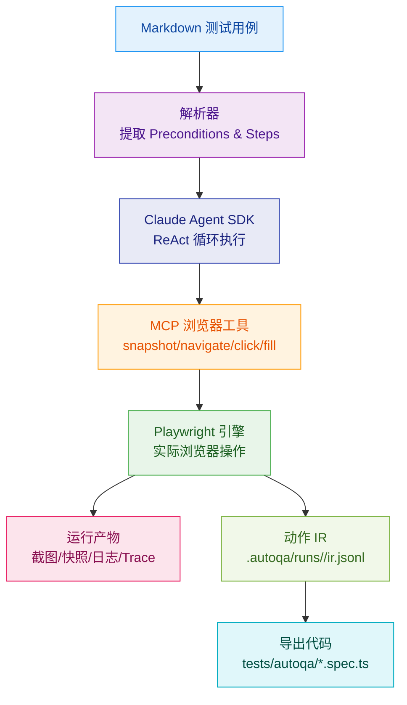

# AutoQA-Agent

[](https://github.com/terryso/AutoQA-Agent/stargazers)
[](https://github.com/terryso/AutoQA-Agent/issues)
[](https://github.com/terryso/AutoQA-Agent/pulls)
[](https://github.com/terryso/AutoQA-Agent/pulls)
[](https://github.com/terryso/AutoQA-Agent/commits)
[](https://github.com/terryso/AutoQA-Agent)
[](https://nodejs.org/)

**[中文](README.zh.md) | [English](README.md)**

基于 Claude Agent SDK + Playwright 的"文档即测试"（Docs-as-Tests）自动化验收测试 CLI 工具。

> **当前状态**：Epic 1-4 的核心能力已实现：`autoqa init` 初始化、`autoqa run` 执行闭环、断言 + 自愈护栏、动作 IR 记录与自动导出 `@playwright/test` 用例。

## 📖 目录

- [概述](#概述)
- [快速开始](#快速开始)
- [工作原理](#工作原理)
- [已实现功能](#已实现功能)
- [使用指南](#使用指南)
- [配置](#配置)
- [运行产物](#运行产物)
- [开发指南](#开发指南)
- [路线图](#路线图)
- [贡献指南](#贡献指南)
- [许可证](#许可证)

## 概述

> **采用 BMAD-METHOD 构建**：本项目采用 [突破性敏捷 AI 驱动开发方法](https://github.com/bmad-code-org/BMAD-METHOD) 开发，具有 21 个专业 AI 代理和结构化工作流，可从错误修复扩展到企业级平台。

AutoQA-Agent 是一个创新的自动化测试工具，让 QA 和产品经理能够用自然语言 Markdown 编写验收测试，直接转换为可执行的测试流程。


更详细的架构边界与约束说明请参考 [`docs/architecture.md`](docs/architecture.md)。

### 核心目标

- **消除脚本脆弱性**：通过智能定位策略，减少 UI 微小变动导致的测试维护成本
- **文档即测试**：用 Markdown 编写测试用例，让非技术人员也能参与测试编写
- **轻量级 Agent 架构**：依托 Claude Agent SDK 管理推理循环，专注优化浏览器工具质量

## 快速开始

### 环境要求

- Node.js >= 20
- npm 或 yarn
- Claude Code 已授权（推荐）或设置 `ANTHROPIC_API_KEY`

### 安装

```bash
# 克隆仓库
git clone https://github.com/terryso/AutoQA-Agent.git
cd AutoQA-Agent

# 安装依赖
npm install

# 构建项目
npm run build

# 全局安装（可选）
npm link
```

### 初始化项目

```bash
# 初始化配置
autoqa init

# 这将创建：
# - autoqa.config.json - 配置文件
# - specs/ - 测试用例目录
# - specs/login-example.md - 示例 Markdown 用例（如果不存在则创建）
```

### 运行第一个测试

```bash
# 运行单个测试（仓库自带示例）
autoqa run specs/saucedemo-01-login.md --url https://www.saucedemo.com/

# 运行目录下所有测试
autoqa run specs/ --url https://www.saucedemo.com/

# 调试模式（显示浏览器界面）
autoqa run specs/saucedemo-01-login.md --url https://www.saucedemo.com/ --debug
```

## 工作原理



### 执行流程

1. **Markdown 解析**：提取前置条件和测试步骤
2. **Agent 执行**：Claude Agent SDK 管理"观察-思考-行动"循环
3. **智能定位**：优先使用稳定的 ref 引用，失败时回退到语义描述
4. **断言与自愈**：对 Verify/Assert 步骤执行断言工具；失败时回流错误上下文触发重试，并受护栏限制
5. **结果收集**：自动记录截图、快照、Trace 与结构化日志
6. **沉淀与导出**：记录动作 IR，并在 spec 成功后自动导出 `@playwright/test` 用例到 `tests/autoqa/`

## 已实现功能

### CLI 命令

- **`autoqa init`** - 初始化项目配置
- **`autoqa run <path> --url <baseUrl>`** - 执行测试用例（`--url` 必填）
- **`autoqa run --debug`** - 调试模式运行
- **`autoqa run --headless`** - 无头模式运行（默认）

### 浏览器工具

| 工具 | 功能描述 | 参数 |
|------|---------|------|
| `snapshot` | 采集可访问性快照 | - |
| `navigate` | 导航到指定页面 | url |
| `click` | 点击元素 | ref, targetDescription |
| `fill` | 填充输入框 | ref, targetDescription, text |
| `select_option` | 选择下拉选项 | ref, label |
| `scroll` | 滚动页面 | direction, amount |
| `wait` | 显式等待 | seconds |
| `assertTextPresent` | 断言页面包含指定文本且至少有一个可见匹配 | text |
| `assertElementVisible` | 断言目标元素可见（支持语义描述解析） | targetDescription |

## 使用指南

### 编写测试用例

测试用例使用 Markdown 格式，需要包含以下结构：

```markdown
# 测试用例标题

## Preconditions

- Base URL: https://example.com
- 测试账号已创建
- 浏览器支持 JavaScript

## Steps

1. Navigate to /login
2. Verify the login form is visible
3. Fill the username field with testuser
4. Fill the password field with password123
5. Click the "Login" button
6. Verify the user is redirected to dashboard
```

说明：当前版本 Base URL 由 `autoqa run --url <baseUrl>` 提供；`## Preconditions` 中的 Base URL 仅用于可读性，不参与解析。

### 断言语句

使用以下开头的步骤会被识别为断言：

- `Verify` / `Assert`
- `验证` / `断言`

### 最佳实践

1. **保持步骤独立**：每个步骤应该是一个独立的操作
2. **使用明确的描述**：避免模糊的操作描述
3. **合理使用断言**：在关键验证点添加断言
4. **管理测试数据**：使用 Preconditions 声明所需的测试数据

## 配置

`autoqa.config.json` 配置文件：

```json
{
  "schemaVersion": 1,
  "guardrails": {
    "maxToolCallsPerSpec": 200,
    "maxConsecutiveErrors": 8,
    "maxRetriesPerStep": 5
  }
}
```

说明：

- `autoqa init` 会在当前目录生成该文件。
- `autoqa run` 也支持在未生成配置文件的情况下运行（会使用内置默认值），但仍需要通过 `--url` 提供 Base URL。

### 环境变量

| 变量名 | 描述 | 默认值 |
|--------|------|--------|
| `ANTHROPIC_API_KEY` | Claude API 密钥 | - |
| `AUTOQA_ARTIFACTS` | 产物落盘策略：`all` / `fail` / `none` | `fail` |
| `AUTOQA_TOOL_CONTEXT` | 工具调用时注入给 Agent 的上下文：`screenshot` / `snapshot` / `none` | `screenshot` |
| `AUTOQA_PREFLIGHT_NAVIGATE` | 运行前是否先 `page.goto(baseUrl)` 进行预热：`1` 开启 | - |

## 运行产物

执行完成后，测试产物与导出结果主要包含：

```
.autoqa/runs/2024-01-01T12-00-00/
├── run.log.jsonl    # 结构化执行日志
├── ir.jsonl         # 动作 IR（用于导出 Playwright Test）
├── screenshots/     # 页面截图（依赖 AUTOQA_ARTIFACTS）
├── snapshots/       # 可访问性快照（依赖 AUTOQA_ARTIFACTS）
└── traces/          # Playwright Trace（依赖 AUTOQA_ARTIFACTS）
```

此外，成功跑通的 spec 会自动导出 `@playwright/test` 用例到：

```
tests/autoqa/*.spec.ts
```

## 开发指南

### 项目结构

```
src/
├── agent/           # Claude Agent SDK 集成、护栏
├── auth/            # 授权探测
├── browser/         # screenshot/snapshot
├── cli/             # CLI 参数解析与命令路由
├── config/          # autoqa.config.json 读取与校验
├── ir/              # 动作 IR、locator 候选与导出依赖的数据结构
├── markdown/        # Markdown spec 解析
├── runner/          # spec 生命周期、trace/导出编排
├── specs/           # spec 发现
└── tools/           # Playwright adapters + assertions
```

### 构建和测试

```bash
# 开发模式
npm run dev

# 运行测试
npm test

# 构建生产版本
npm run build
```

## 路线图

### 已完成（Epic）

- [x] Epic 1：零配置上手（项目初始化）
- [x] Epic 2：执行闭环（从 Markdown 驱动浏览器完成流程）
- [x] Epic 3：验收判定与自愈闭环（断言 + 失败重试 + 护栏）
- [x] Epic 4：沉淀与导出（动作 IR + 自动导出 Playwright Test）

### Backlog（可选方向）

- [ ] 丰富导出能力（更多语义步骤解析与更完整的断言映射）
- [ ] 增加更多示例 specs 与端到端演示项目
- [ ] 文档与架构图持续完善

## Star History

[](https://www.star-history.com/#terryso/AutoQA-Agent&type=date&legend=top-left)

## 贡献指南

我们欢迎所有形式的贡献！

### 提交 Issue

- 使用 Issue 模板报告 Bug 或提出功能建议
- 提供详细的复现步骤和环境信息

### 提交 Pull Request

1. Fork 项目
2. 创建特性分支：`git checkout -b feature/amazing-feature`
3. 提交更改：`git commit -m 'Add amazing feature'`
4. 推送分支：`git push origin feature/amazing-feature`
5. 创建 Pull Request

### 开发规范

- 遵循现有代码风格
- 添加适当的测试
- 更新相关文档

## 许可证

本项目采用 [MIT 许可证](LICENSE)。

## 致谢

- [Claude Agent SDK](https://github.com/anthropics/claude-agent-sdk) - Agent 框架
- [Playwright](https://playwright.dev/) - 浏览器自动化
- [Mermaid](https://mermaid.js.org/) - 图表支持

---

## 常见问题

<details>
<summary>如何调试失败的测试？</summary>

使用 `--debug` 参数运行测试，可以看到浏览器界面。查看 `.autoqa/runs/<runId>/run.log.jsonl` 获取详细执行日志。
</details>

<details>
<summary>是否支持 CI/CD 集成？</summary>

是的，可以通过 `--headless` 参数在 CI 环境中运行。退出码约定：0=成功，1=测试失败，2=配置错误。
</details>

<details>
<summary>如何处理动态内容？</summary>

Agent 会自动重试失败的操作。建议使用 `wait` 工具等待动态内容加载完成。
</details>

---

如有任何问题，请提交 [Issue](https://github.com/terryso/AutoQA-Agent/issues) 或加入我们的讨论。